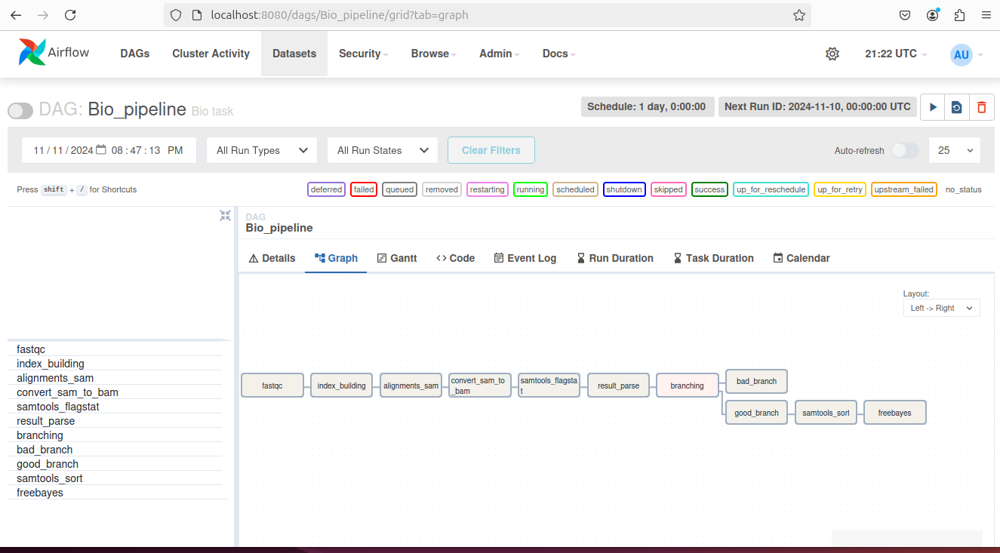

# 4 Задание

## Источник

[Результаты секвенирование WES homo sapience](https://www.ebi.ac.uk/ena/browser/view/SRR12799740?show=reads)

[Референсный геном homo sapience](https://hgdownload.soe.ucsc.edu/goldenPath/hg38/bigZips/hg38.fa.gz)

## Файлы

- [Основной баш-скрипт последовательности](script.sh)
- [Скрипт для парсинга результатов samtools flagstat](parseMappedResult.py)
- [Результаты fastqc](my_results_fastqc.html)
- [Результаты samtools flagstat](samtools_result.txt)
- [Результаты freebayes](sample.vcf)
- [Код пайплайна](bio.py)

## Пайплайн
### Установка
Основная информация предлагается
с [официального сайта](https://airflow.apache.org/docs/apache-airflow/stable/start.html)
Но при использовании debian/ubuntu и прочих OS, где единственный python, требуются дополнительные действия.
Предлагаются разные решения, наиболее подробный список
на [stackoverflow](https://stackoverflow.com/questions/75602063/pip-install-r-requirements-txt-is-failing-this-environment-is-externally-mana)

Необходимо иметь установленный python, и если он не связан с пакентными менеджерами ОС:

```shell
export AIRFLOW_HOME=~/airflow
pip install apache-airflow
```

Если же имеются проблемы
описанные [здесь](https://stackoverflow.com/questions/75602063/pip-install-r-requirements-txt-is-failing-this-environment-is-externally-mana)
из-за пакетнных менеджеров, то предлагается простой вариант:

```shell
export AIRFLOW_HOME=~/airflow
python3 -m venv .venv
source .venv/bin/activate
pip install apache-airflow
```

И при последующий работе необходимо будет использовать ``source .venv/bin/activate``,
чтобы заходить в данное окружение, которое не пересекается с основным.
Далее, находясь в данно окружении Python (env), можем запустить:

```shell
airflow standalone
```

Далее подключаемся через интерфейс браузера, и можем взаимодействовать через GUI по
localhost:8080

Чтобы проверить работоспособность, можно запускать одну из заранее подготовленных программ:

```shell
airflow tasks test example_bash_operator runme_0
```

Для более детальной настройки смотреть
подробную [документацию](https://airflow.apache.org/docs/apache-airflow/stable/start.html)

### Простой пример
Пример взят с [туториала](https://airflow.apache.org/docs/apache-airflow/stable/tutorial/fundamentals.html#adding-dag-and-tasks-documentation)
Файл [simple_example.py](tutorial.py), прост в написании и идейно понятен, но громоздок
из-за держания подробных описаний. Чтобы DAG добавился в список, достаточно добавить его в ``~/airflow/dags``
```shell
python ~/airflow/dags/tutorial.py
```
- Примечание: этот файл и так есть при вызове ``airflow standalone``. Не следует добавлять повторяющиеся dag'и

### Пайплайн
Код пайплайна на фреймворке - [bio.py](bio.py)

Графической представление в интерфейсе:
