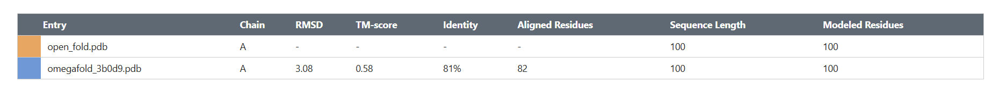
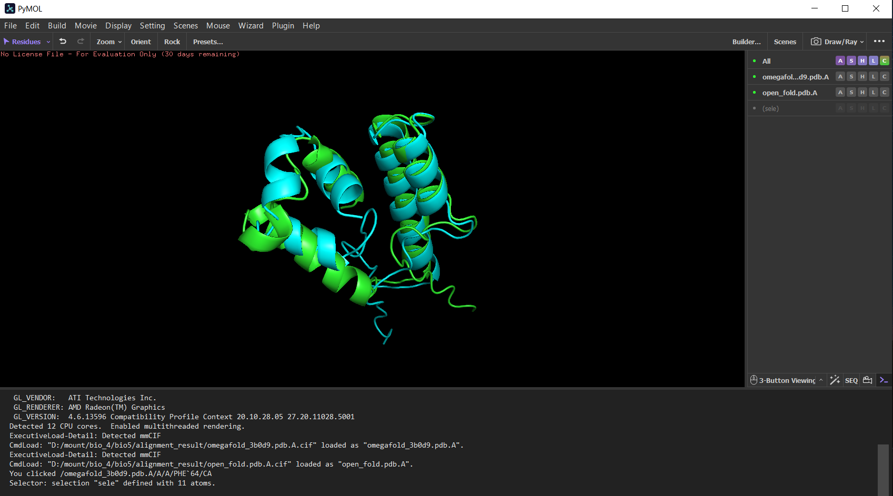
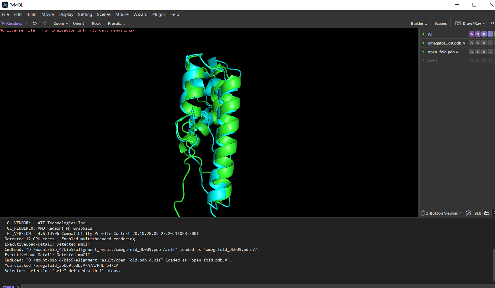
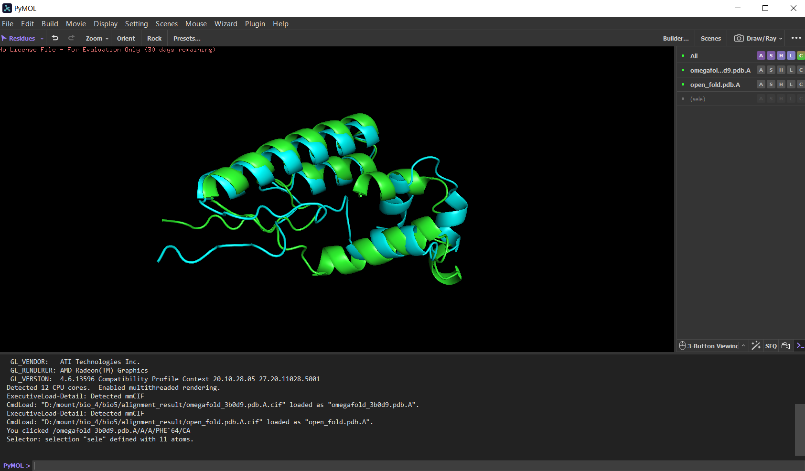

## 5 Задание

### Используемые данные и инструменты

Последовательность: MSTLTSVSGFPRIGQNRELKKIIEGYWKGANDLAAVKATAAELRAKHWRLQQAAGIDLIASNDFSYYDQMLDTAILLNVIPQRYQRLAFDDQEDTLFAMA

Программы предсказатели:

1) OpenFold [ссылка](https://colab.research.google.com/github/aqlaboratory/openfold/blob/main/notebooks/OpenFold.ipynb)
2) Omegafold [ссылка](https://colab.research.google.com/github/sokrypton/ColabFold/blob/main/beta/omegafold.ipynb)

Инструмент выравнивания:
jFATCAT-flexible (в списке Alignment Method) - [ссылка]()

### Полученные ноутбуки с предсказанной структурой

- OpenFold: [OpenFold.ipynb](OpenFold.ipynb)
- OmegaFold: [omegafold.ipynb](omegafold.ipynb)

### Полученные предсказания структур в формате PDB

- OpenFold: [open_fold.pdb](open_fold.pdb)
- OmegaFold: [omegafold_3b0d9.pdb](omegafold_3b0d9.pdb)

### Полную выдачу программы выравнивания в виде PDB:

Файлы в папке [alignment_result](alignment_result)

- [omegafold_3b0d9.pdb.A.cif](alignment_result%2Fomegafold_3b0d9.pdb.A.cif)
- [open_fold.pdb.A.cif](alignment_result%2Fopen_fold.pdb.A.cif)
- [sequence_alignment_2024-12-8-23-57-53.fasta](alignment_result%2Fsequence_alignment_2024-12-8-23-57-53.fasta)
- [transformation_matrices_2024-12-8-23-57-53.json](alignment_result%2Ftransformation_matrices_2024-12-8-23-57-53.json)

Резултаты 

| Entry	              | Chain | 	RMSD | 	TM-score | 	Identity | 	Aligned Residues | 	Sequence Length	 | Modeled Residues 
|---------------------|-------|-------|-----------|-----------|-------------------|-------------------|------------------|
| open_fold.pdb       | 	A    | 	-    | 	-        | 	-        | 	-                | 	100              | 	100             |
| omegafold_3b0d9.pdb | 	A    | 	3.08 | 	0.58     | 	81%      | 	82               | 	100              | 	100             |

### Проект/сессию/иное из программы визуализации (например, в PyMOL - сессия *.pse)

[session.pse](session.pse)

### Снимки экрана / запись видео с полученным раскрашенным выравниванием

### Краткие выводы о совпадении полученных предсказаний в свободной форме
По результатам выравнивания, получилась 80% совпадения.
Визуально можно увидеть схожесть структур, где отличаются ответвляющиеся части.

Это было вызвано тем, что алгоритмы предсказаний работают по разным алгоритмам, и в целом не обязаны иметь одинаковый
результат. Из-за этого, возникли отличия, но достаточно небольшие.

